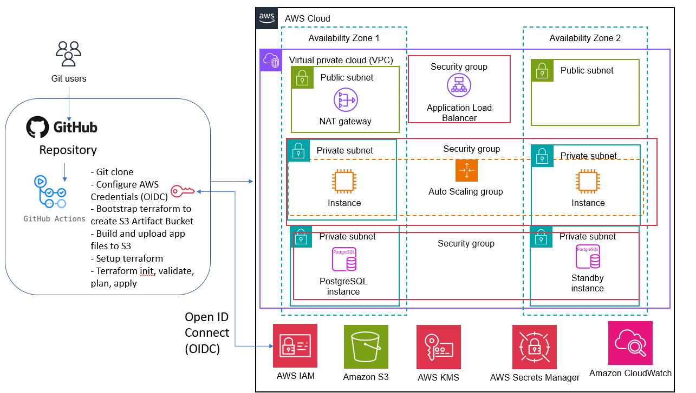
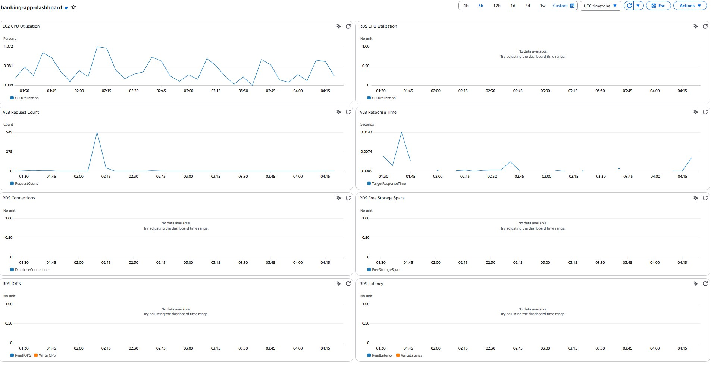
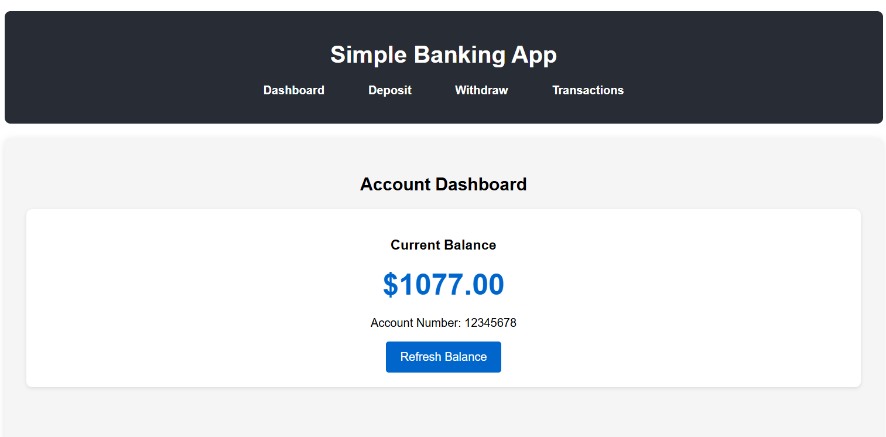

# Simple Banking App with terraform and github actions CI/CD

This repository contains Terraform code and application code to deploy a simple banking application on AWS. It features a Node.js backend, PostgreSQL database, and a React frontend. CI/CD is handled by GitHub Actions using temporary credentials via OpenID Connect (OIDC) for secure access to AWS to deploy the application and its infrastructure.

## Architecture Diagram

The following diagram illustrates the end-to-end deployment pipeline and infrastructure architecture for a secure, scalable web application deployed on AWS using Terraform and GitHub Actions. This setup automates infrastructure provisioning and application deployment across multiple Availability Zones (AZs) within a Virtual Private Cloud (VPC), following AWS best practices.

GitHub Actions handles CI/CD workflows, using OpenID Connect (OIDC) to assume temporary AWS credentials.

The pipeline bootstraps infrastructure with Terraform, stores build artifacts in Amazon S3, and deploys application workloads.

The AWS environment spans three AZs with public and private subnets, an Application Load Balancer, Auto Scaling Group of EC2, PostgreSQL RDS database in HA configuration, and integrations with IAM, Secrets Manager, KMS, and CloudWatch for security and observability.



## Repository Structure

```
simple-banking-app/
├── .github/                 # GitHub specific configurations
│   └── workflows/           # GitHub Actions workflows
│       └── cicd.yml         # CI/CD pipeline configuration
├── backend/                 # Node.js Express API
│   ├── server.js            # Main application server
│   ├── init-db.js           # Database initialization script
│   ├── package.json         # Node.js dependencies
│   └── setup.sh             # Setup script for local development
├── frontend/                # React frontend application
│   ├── public/              # Static assets
│   ├── src/                 # React source code
│   └── package.json         # Frontend dependencies
├── terraform/               # Infrastructure as Code
│   ├── bootstrap/           # Initial resources (S3 bucket)
│   │   ├── main.tf
│   │   ├── variables.tf
│   └── main/                # Main infrastructure
│       ├── alb.tf           # Application Load Balancer configuration
│       ├── app.tf           # EC2 and Auto Scaling Group configuration
│       ├── backend.tf       # S3 backend to store the terraform state files
│       ├── kms.tf           # KMS key for encryption
│       ├── main.tf          # VPC and networking resources
│       ├── monitoring.tf    # Cloudwatch log groups, alarms and Dashboard for monitoring
│       ├── outputs.tf       # Terraform outputs
│       ├── rds.tf           # PostgreSQL database configuration
│       ├── secrets.tf       # AWS Secrets Manager configuration
│       ├── variables.tf     # Input variables
│       └── scripts/         # EC2 instance setup scripts
│           └── user-data.sh # EC2 instance initialization script
```
## Security Features

- **KMS Customer Managed Key (CMK)** for encryption of:
  - RDS database storage
  - Secrets Manager secrets
  - CloudWatch logs

- **Enhanced RDS Security**:
  - Storage encryption
  - Leveraging on secrets manager for database credentials
  - Automated backups enabled
  - Multi-AZ deployment
  - Delete protection enabled

- **Network Security**:
  - Private subnets for application and database tiers
  - Security groups with least privilege access
  - NAT Gateway for outbound internet access

- **IAM Security**:
  - EC2 Instance profile with least privilege permissions


## 🔐 Monitoring and Logging

- **CloudWatch Dashboards** for application and infrastructure metrics

- **CloudWatch Alarms** for critical thresholds
- **CloudWatch Logs** for application and system logs
- **SNS Topics** for alerts and notifications
- **Auto Scaling** based on CPU utilization

## 🚀 CI/CD Pipeline

- **GitHub Actions** automates:
  - Infrastructure provisioning with Terraform
  - Application deployment
- **OpenID Connect (OIDC)** integration for secure, short-lived AWS credentials
- Rolling deployment for each new application upgrade


## Prerequisites

- You need to have an AWS account with IAM sufficient permissions to deploy the project
- You also need a github account to setup CI/CD pipeline

## Getting Started

1. Clone the repository
   ```
   git clone https://github.com/huangz27/simple-banking-app.git
   ```
2. Set up OIDC with github actions

Follow [this AWS blog post](https://aws.amazon.com/blogs/security/use-iam-roles-to-connect-github-actions-to-actions-in-aws/) to configure IAM roles for GitHub Actions using OIDC.

3. Adjust the variables (if you are deploying on your own)

Change artifact_bucket_name within terraform -> bootstrap -> variables.tf file

4. Deploy the application:

Push changes to the repository to trigger GitHub Actions workflows.

Monitor the deployment process via the Actions tab.

## Post-Deployment Steps

1. Check the GitHub Actions output in the **Terraform Apply (`main` branch only)** step

The alb_dns_name is where users can access the app frontend, api_endpoints to hit the backend APIs directly via ALB.

Example:
```
Outputs:

alb_dns_name = "banking-app-alb-1115278767.ap-southeast-1.elb.amazonaws.com"
api_endpoints = {
  "balance" = "http://banking-app-alb-1115278767.ap-southeast-1.elb.amazonaws.com/api/balance/12345678"
  "deposit" = "http://banking-app-alb-1115278767.ap-southeast-1.elb.amazonaws.com/api/deposit"
  "transactions" = "http://banking-app-alb-1115278767.ap-southeast-1.elb.amazonaws.com/api/transactions/12345678"
  "withdraw" = "http://banking-app-alb-1115278767.ap-southeast-1.elb.amazonaws.com/api/withdraw"
}
```


## Important Notes

- The RDS instance, KMS CMK key and secret manager has deletion protection enabled. To delete them, you will need to remove deletion_protection = true for RDS and prevent_destroy = true for KMS and secret manager

## 📄 License

This project is licensed under the [MIT License](LICENSE).